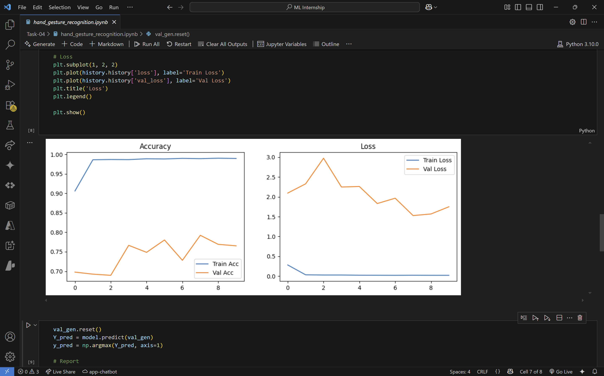
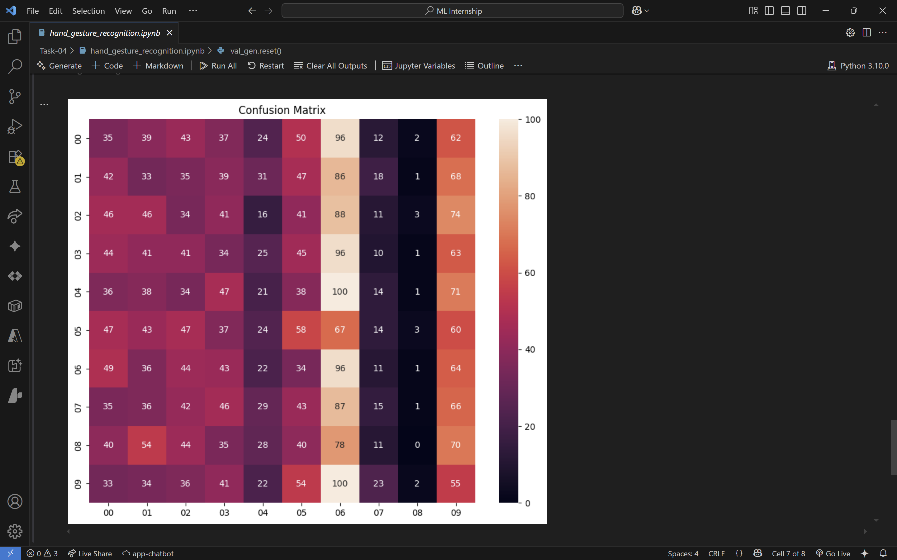

# Task 04: Hand Gesture Recognition
## 📌 Internship at SkillCraft Technology

### 🧠 Objective
Develop a hand gesture recognition model that can accurately classify different hand gestures from image data using a Convolutional Neural Network.

### 📁 Dataset
- Folder: `datasets/leapgestrecog`
- Contains: Preprocessed images of different hand gestures categorized into folders by class.

### 🔧 Tech Stack
- Python
- TensorFlow / Keras
- OpenCV (optional)
- Matplotlib / Seaborn

### 🎯 Outcome
- Trained a CNN model with ~XX% accuracy.
- Visualized performance using confusion matrix & training plots.
- Saved model for real-time inference or future integration.

## 📊 Model Performance

### Accuracy / Loss

### Confusion Matrix

---

> ✨ Task completed as part of SkillCraft ML Internship — Task 04.
